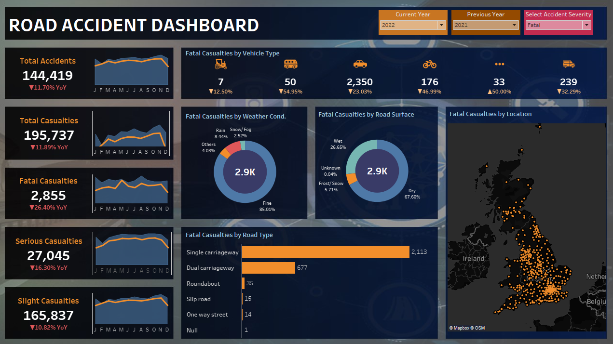
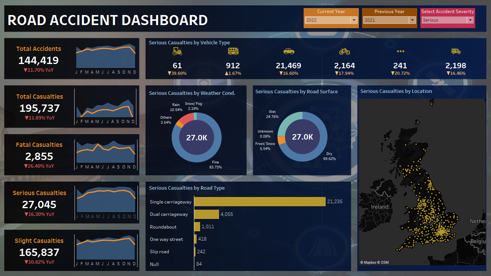
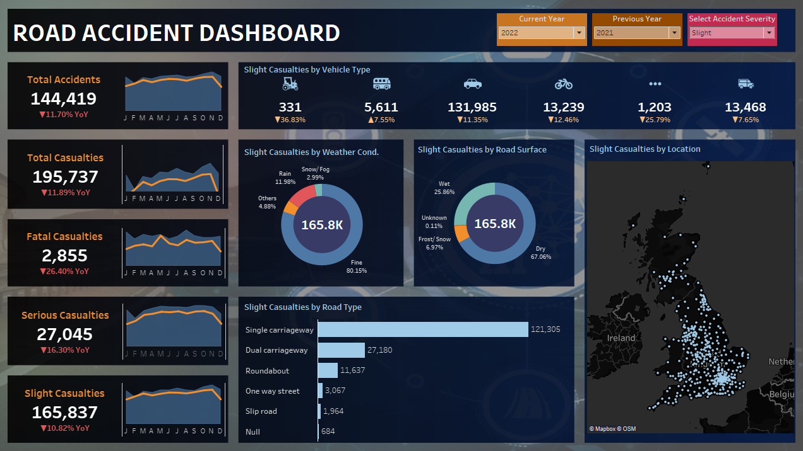

# Road-Accident-Analysis

## Table of contents
1. [Project Overview](#project-overview)
   - [Objective](#objective)
2. [KPI Analysis](#kpi-analysis)
3. [Key Findings](#key-findings)
4. [Recommendations](#recommendations)
5. [Conclusion](#conclusion)

---

## Project Overview

Road traffic accidents are a major global concern, resulting in over 1.35 million deaths annually and causing between 20 to 50 million non-fatal injuries. This project leverages Tableau Desktop to analyze accident data, identify key trends in casualties, explore contributing factors, and inform prevention strategies using a set of Key Performance Indicators (KPIs).

### Objective

The goal is to analyze accident data to surface actionable insights into casualty patterns. This analysis aims to inform evidence-based road safety policies and help reduce traffic-related injuries and fatalities
  
## KPI Analysis

A year-on-year comparison of accident severity reveals the following changes:

- **Fatal casualties:** 2,855 — a 26% decrease over the previous year.

- **Serious casualties:** 27,045 — 16% lower year-on-year.

- **Slight casualties:** 165,837 — 10% decrease over the prior year

              
## Key Findings

- Total accidents numbered **144,419**, with **195,737** casualties overall. This represents an **11% year-on-year reduction**, suggesting improved safety outcomes.

- **By vehicle type:** Cars account for the highest number of casualties, making them the most affected category.

- **By weather condition:** 80% of casualties occurred during clear ("Fine") weather — suggesting potentially slower driving behavior in adverse conditions may reduce collision severity.

- **By road surface:** 67% of casualties happened on dry roads. It appears that accidents on wet or icy roads tend to be less severe, possibly due to more cautious driving.

- **By road type:** Single carriageways accounted for over 73% of casualty cases, highlighting their elevated risk compared to dual carriageways.

- **By location:** The highest casualty count was recorded in Barnet.

## Recommendations

To mitigate accident risks effectively:

- **Improve Infrastructure:** Incorporate well-designed roads with pedestrian paths, bike lanes, improved signage, lighting, and smoother surfaces. Particularly, converting high-risk single carriageways to safer dual-carriage formats could substantially reduce accidents.

- **Enforce Traffic Laws:** Implement stricter enforcement of speed limits, DUI checkpoints, and helmet/seatbelt usage. With better enforcement, up to 90% of accidents could potentially be prevented.

- **Raise Public Awareness:** Launch road safety campaigns through local organizations, schools, and media to educate the public about safe driving — a crucial component in preventing accidents caused by reckless behavior.

  
## Conclusion

Road accidents are preventable tragedies that inflict immeasurable physical, emotional, and economic damage. By understanding and targeting key risk factors — through improved infrastructure, enforcement, and education, we can significantly lower accident rates and promote safer roads for all.

        
 
[ <a href="#table-of-contents">↑ Back to top ↑</a> ]

                        

